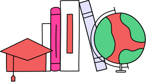
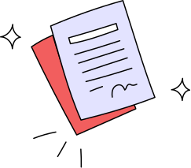
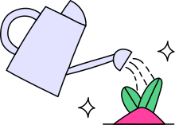
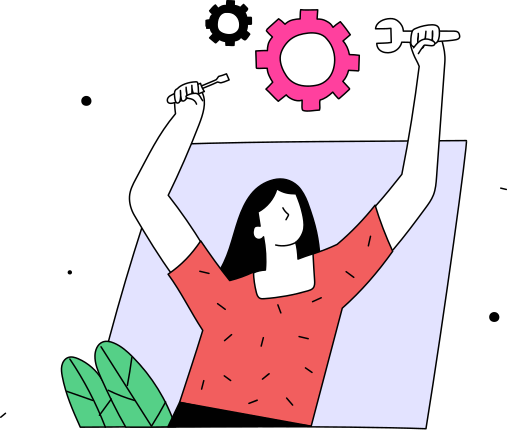
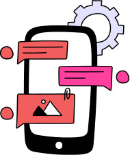
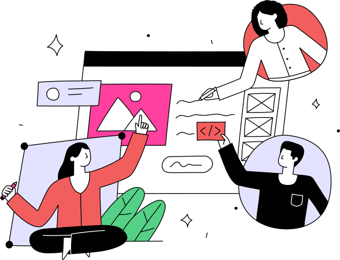

<!-- PROJECT LOGO & HEADER -->
<div align="center">
<svg width="100%" height="40" xmlns="http://www.w3.org/2000/svg">
  <defs>
    <pattern id="x-pattern" patternUnits="userSpaceOnUse" width="8" height="8">
      <path d="M0,0 l8,8 M8,0 l-8,8" stroke="#ffa0a0" stroke-width="1"/>
    </pattern>
  </defs>
  <rect width="100%" height="40" fill="url(#x-pattern)" />
</svg>
</div>

<div align="center">



<h1>Project UPE: document generator</h1>
<p>
<strong>Automating bureaucracy. Empowering education.</strong>


The backend solution to streamline internship management at the University of Pernambuco.
</p>

<!-- BADGES -->

<p>


</br>


</p>

<br />
<a href="#about">About</a> •
<a href="#features">Features</a> •
<a href="#tech-stack">Tech Stack</a> •
<a href="#getting-started">Getting Started</a> •
<a href="#team">Team</a>
</div>

<br />

<!-- ABOUT SECTION -->

<h2 id="about">The Mission</h2>

<div align="center">
<table style="border: none">
<tr>
<td width="60%">
<h3>From Red Tape to Digital Efficiency</h3>
<p>
Managing internship documents at <strong>UPE (Campus Petrolina)</strong> has historically been a manual bottleneck. With <strong>8 Licentiate courses</strong> and around <strong>4,480 documents per cycle</strong>, the administrative load on coordinators and frustration for students is immense.
</p>
<p>
This project creates a digital ecosystem where students can generate, validate, and manage their internship paperwork (TCE, Supervision Declarations and others in the future) instantly, ensuring compliance and saving thousands of hours of manual work.
</p>
</td>
<td width="40%" align="center">


</td>
</tr>
</table>
</div>

<!-- FEATURES SECTION -->

<h2 id="features">Key Features</h2>

> **Note:** This is the backend API. The frontend client has its own repository and can be found [here](https://github.com/thiagocrux/upe-document-generator-web-client).

<div align="center">
<table>
<tr>
<td width="33%" align="center">



<h3>Smart Gen</h3>
<p>Dynamic generation of PDF documents based on student data.</p>
</td>
<td width="33%" align="center">


<h3>Secure Access</h3>
<p>JWT Authentication with institutional email validation and Role-Based Access.</p>
</td>

<td width="33%" align="center">



<h3>Accessibility First</h3>
<p>Built-in VLibras, Dyslexic-friendly fonts, and High Contrast themes.</p>
</td>
</tr>
<tr>
<td width="33%" align="center">



<h3>UX Personalization</h3>
<p>Customizable themes (Modern/Drawing) saved to user profile.</p>
</td>
<td width="33%" align="center">


<h3>Digital Security</h3>
<p>Audit logs, document hashing, and anti-fraud mechanisms.</p>
</td>
<td width="33%" align="center">



<h3>Responsive</h3>
<p>Fully optimized for mobile use, from registration to download.</p>
</td>
</tr>
</table>
</div>

<!-- TECH STACK SECTION -->

<h2 id="tech-stack">Tech Architecture</h2>

This project follows a rigorous Clean Architecture approach with professional CI/CD pipelines. For a deeper dive into the technical details, please see the [Architecture Documentation](doc/ARCHITECTURE.md).

* __Backend (API)__
  * Core: Java 21, Spring Boot 3.2.5
  * Database: PostgreSQL
  * Testing: JUnit 5, Mockito, Jacoco (Coverage) 
  * Quality: SonarQube (Static Analysis)
  * Documentation: [Swagger/OpenAPI](http://localhost:8080/swagger-ui.html)
* __DevOps & Standards__
  * CI/CD: GitHub Actions (Lint, Test, Build, Security Scan)
  * Workflow & Commits: See our [Team Contribution Guide](CONTRIBUTING.md)

<!-- GETTING STARTED -->

<h2 id="getting-started">Getting Started</h2>

### Prerequisites
* Java 21 JDK
* Maven 3.8+
* [Docker](https://www.docker.com/) & [Docker Compose](https://docs.docker.com/compose/) (Recommended for database)

### 🔧 Setup & Run

1.  **Clone the repository**
    ```bash
    git clone https://github.com/ambrosiaandrade/project-upe-document-server.git
    cd project-upe-document-server
    ```

2.  **Start the database with Docker**

    The easiest way to get the database running is with Docker Compose. This will start a PostgreSQL container with the correct database and credentials.
    ```bash
    docker-compose up -d
    ```
    The environment variables for the database (`DB_URL`, `DB_USER`, `DB_PASS`) are already set to match the `docker-compose.yml` file by default in `application.properties`.

    > **Alternative: Manual Database Setup**
    > If you prefer not to use Docker, ensure you have a PostgreSQL instance running and set the following environment variables:
    > ```bash
    > export DB_URL=jdbc:postgresql://<your_host>:<your_port>/<your_db>
    > export DB_USER=<your_user>
    > export DB_PASS=<your_password>
    > ```

3.  **Run the application**
    ```bash
    mvn spring-boot:run
    ```
    The API will be available at `http://localhost:8080`.

<!-- TEAM SECTION -->

<h2 id="team" align="center">The Squad</h2>



<div align="center">

<table>
  <tr>
    <td align="center">
      <strong>Ambrósia Andrade</strong><br>
      PO | UX/UI | Backend Engineer & DevOps<br><br>
      <a href="https://www.linkedin.com/in/ambrosiaandrade/" target="_blank">
        
      </a>
      <a href="https://github.com/ambrosiaandrade" target="_blank">
        
      </a>
      <a href="mailto:ambrosiaandrade.pe@gmail.com" target="_blank">
        
      </a>
    </td>
    <td align="center">
      <strong>Thiago Cruz</strong><br>
      Frontend Engineer<br><br>
      <a href="https://linkedin.com/in/thiagocrux" target="_blank">
        
      </a>
      <a href="https://github.com/thiagocrux" target="_blank">
        
      </a>
      <a href="mailto:thiagocruz.eu@gmail.com" target="_blank">
        
      </a>
    </td>
    <td align="center">
      <strong>Matheus Cruz</strong><br>
      Frontend Engineer<br><br>
      <a href="https://linkedin.com/in/matheuscruzhen/" target="_blank">
        
      </a>
      <a href="https://github.com/matheuscruzhen" target="_blank">
        
      </a>
      <a href="mailto:matheuscruzhen@gmail.com" target="_blank">
        
      </a>
    </td>
    <td align="center">
      <strong>Tainá Dutra</strong><br>
      QA Specialist<br><br>
      <a href="https://www.linkedin.com/in/taina-rigoni" target="_blank">
        
      </a>
      <a href="https://github.com/tainarigoni" target="_blank">
        
      </a>
      <a href="mailto:tainarigoni@gmail.com" target="_blank">
        
      </a>
    </td>
  </tr>
</table>

<p><em>Special thanks to our stakeholders: <strong>Liliane</strong> (Biology Coord.) & <strong>Renata</strong> (Internship Coord.)</em></p>
</div>

</br>

<!-- RESOURCES SECTION -->

<h3>Illustrations & Visual Resources</h2>

The illustrations and visual patterns used in this project were obtained from:

- [HelloYes Patterns — Pattern #8](https://patterns.helloyes.dev/pattern/8/)
- [IllustrationKit — Yippy Illustrations](https://illustrationkit.com/illustrations/yippy)

> ✅ *If you are using licensed images or patterns, please check the terms of use and give proper credit as requested by the authors.*

</br>

<!-- FOOTER -->

<div align="center">
<p>
Built with ❤️ in <strong>Pernambuco, Brazil</strong>.


This project is protected under the MIT License.
</p>

<div align="center">
<svg width="100%" height="40" xmlns="http://www.w3.org/2000/svg">
  <defs>
    <pattern id="x-pattern" patternUnits="userSpaceOnUse" width="8" height="8">
      <path d="M0,0 l8,8 M8,0 l-8,8" stroke="#ffa0a0" stroke-width="1"/>
    </pattern>
  </defs>
  <rect width="100%" height="40" fill="url(#x-pattern)" />
</svg>
</div>

</div>
